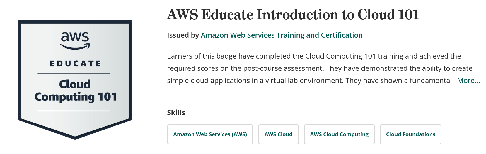
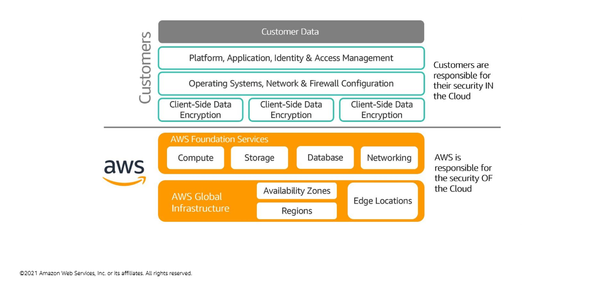
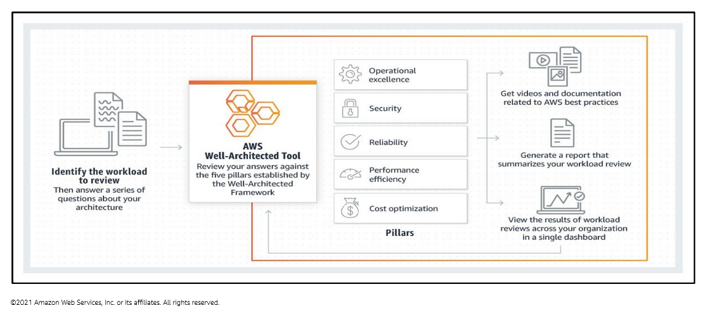
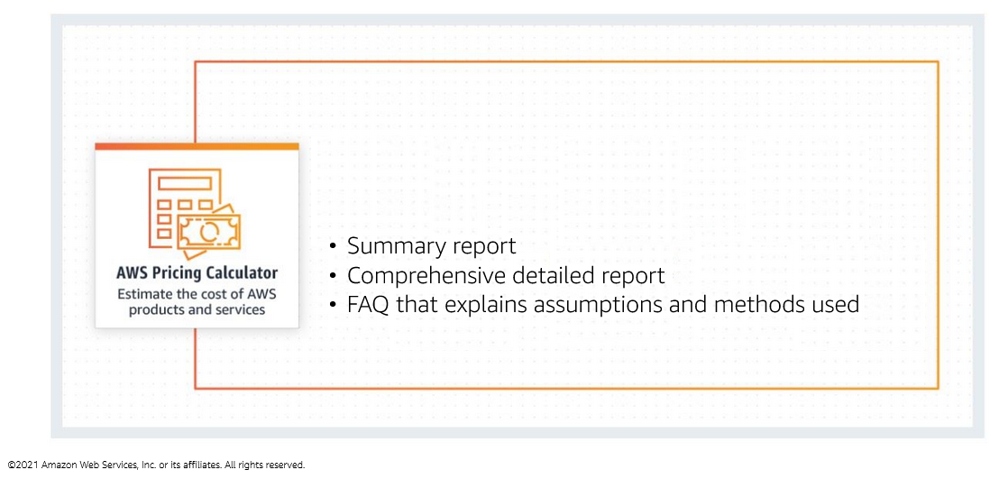
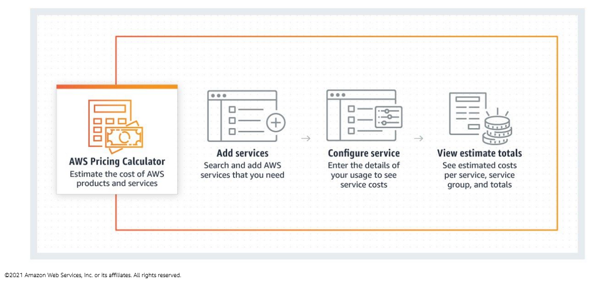
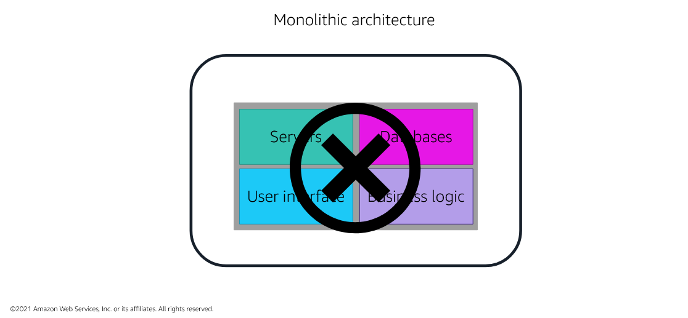
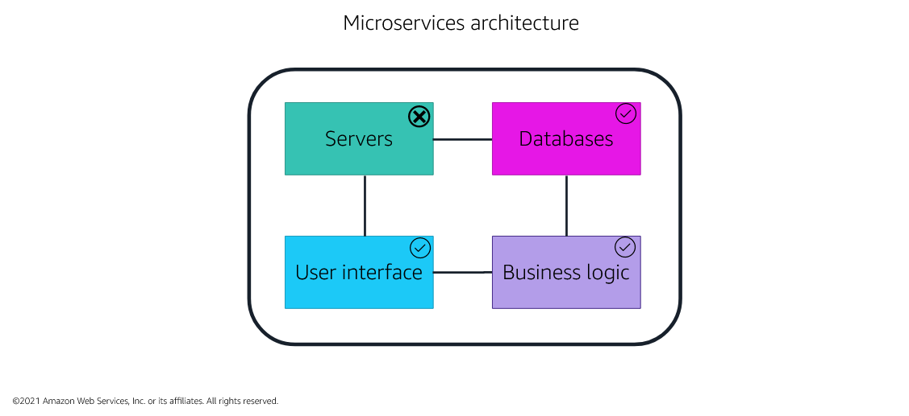
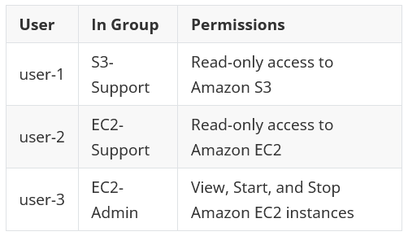
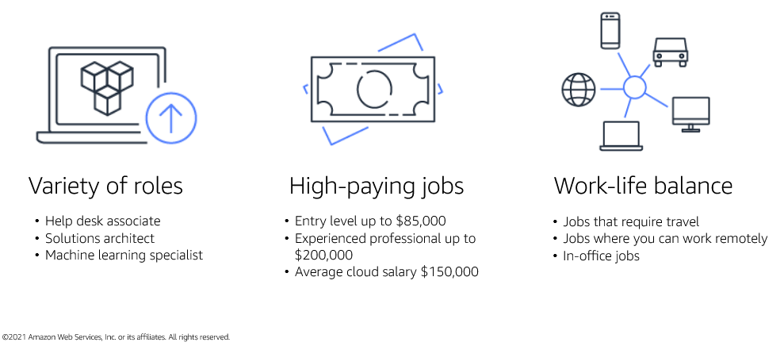
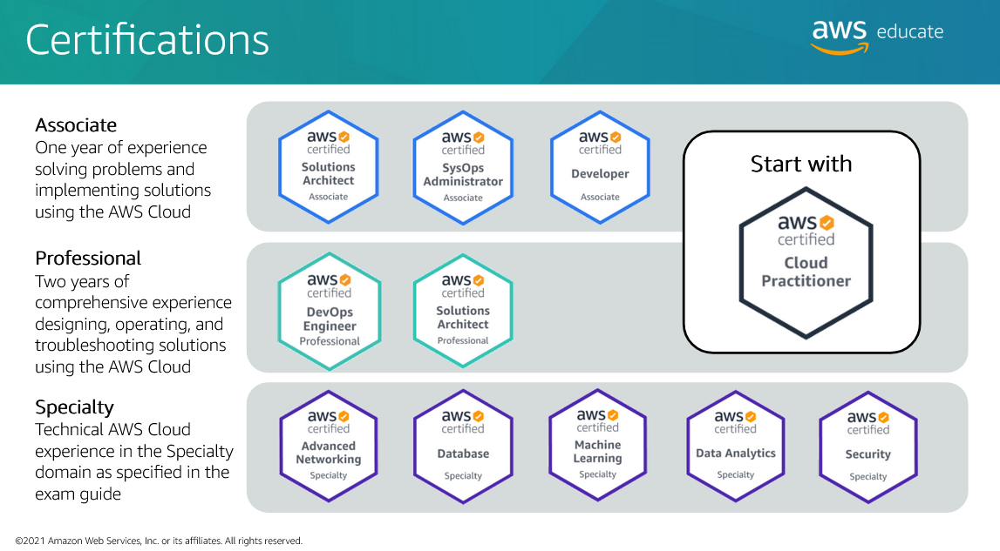

# Introduction to Cloud 101

> 2022/05/28 ~ 2022/06/15

- source: [AWS Educate](https://aws.amazon.com/education/awseducate/)

## My Badge

## Introduction to Cloud 101

##### Why learn about the cloud?

- Demand for cloud computing skills is increasing
- Cloud computing skills are relevant for all IT professionals
- Cloud certification validates knowledge and skills

## Introduction to Cloud Computing

##### Why cloud computing?

- IT assets as programmatic resources to quickly set up and tear down resources
- Access resources dynamically for __agility__ and __flexibility__ to meet customer needs
- Pay-as-you-go to test and use the system without being fully committed

##### Definition of cloud computing

Cloud computing is the on-demand delivery of IT resources over the internet with pay-as-you-go pricing.

- __On-demand delivery__: A cloud provider has the resources you need, when you need them

- __IT resources over the internet__: Servers, networks, storage, development tools, and applications

- __Pay-as-you-go__: Pay only for what you need when you use it

##### Six benefits of cloud computing

1. Trade upfront expense for variable expense
2. Stop spending money to run and maintain data centers
3. Stop guessing capacity
4. Benefit from massive economies of scale
5. Increase speed and agility
6. Go global in minutes

##### Deploying to the cloud

Cloud service and deployment methods provide different levels of control, flexibility, and management.

Deployment models include

- __Infrastructure as a service (IaaS)__
  - Contains the basic building blocks for cloud IT
  - Provides access to networking features, computers (virtual or on dedicated hardware), and data storage space
  - Provides the highest level of flexibility and management control over your IT resources
  - EC2, S3, RDS, and Route 53

- __Platform as a service (PaaS)__
  - Removes the need for organizations to manage the underlying infrastructure (usually hardware and operating systems)
  - They can focus on the deployment and management of applications
  - These tools give developers the ability to be more efficient because they don't need to worry about resource procurement, capacity planning, software maintenance, and patching
  - Elastic Beanstalk

- __Software as a service (SaaS)__
  - A completed software product that the service provider runs and manages
  - With a SaaS offering, you do not have to think about how the service is maintained or how the underlying infrastructure is managed
  - You only must think about how you will use that particular piece of software
  - video meeting sites, email sites, file sharing sites, and messaging apps

Deployment strategies include

- __Cloud__
  - In a cloud-based deployment model, you can migrate existing applications to the cloud, or you can design and build new applications in the cloud
  - You can build those applications on low-level infrastructure that requires your IT staff to manage them
  - You can build them by using higher-level services that reduce the management, architecting, and scaling requirements of the core infrastructure

- __Hybrid__
  - In a hybrid deployment, cloud-based resources are connected to on-premises infrastructure
  - You can integrate cloud-based resources with legacy IT applications

- __On-premises__
  - Also known as a private cloud deployment
  - In this model, resources are deployed on premises by using virtualization and resource management tools
  - Increase resource utilization by using application management and virtualization technologies

Each type of deployment model and strategy has a shared responsibility between you and the cloud service provider.

## Introduction to AWS

##### AWS benefits

- On-demand access to over 175 services cloud-based services
- Pay-as-you-go pricing
- No upfront capital expenses or commitments
  - The ability to try a lot of experiments
  - Not having to live with the collateral damage of failed experiments
- Toolbox of high-end services

### AWS Global Infrastructure

- Region
  - A physical location around the world where data centers are clustered together
- Availability Zone
  - A zoned area within a Region that can harbor one or more data centers (typically three)
  - House all the hardware devices that AWS offers
- Edge Location
  - Are connected to the AWS Regions through the AWS network across the globe
  - They link with tens of thousands of networks for improved origin fetches and dynamic content acceleration

##### AWS Global Infrastructure benefits

- Performance
- Availability
- Security
- Reliability
- Scalability
- Low Cost

##### Shared responsibility

- Customers are responsible for the security of everything that they create and put __IN__ the AWS Cloud

  - User access
  - Encryption
- AWS manages the security __OF__ the cloud, specially the physical infrastructure that hosts your resources, which include:

  - Physical security of data centers
  - Hardware and software infrastructure
  - Network infrastructure
  - Virtualization infrastructure

### AWS Well-Architected Framework

- Operational Excellence
  - The ability to run and monitor systems to deliver business value and continually improve supporting processes and procedures
  - Performing operations as code, annotating documentation, anticipating failure, and frequently making small, reversible changes
- Security
  - The ability to protect information, systems, and assets while delivering business value through risk assessments and mitigation strategies
  - Automate security best practices when possible
  - Apply security at all layers
  - Protect data in transit and at rest
- Reliability
  - The ability of a system to:
    - Recover from infrastructure or service disruptions
    - Dynamically acquire computing resources to meet demand
    - Mitigate disruptions such as transient network issues or misconfigurations
  - Testing recovery procedures, scaling horizontally to increase aggregate system availability, and automatically recovering from failure
- Performance Efficiency
  - The ability to use computing resources efficiently to meet system requirements and to maintain that efficiency as demand changes and technologies evolve
  - Experimenting more often, using serverless architectures, and designing systems to be able to go global in minutes
- Cost Optimization
  - The ability to run systems to deliver business value at the lowest price point
  - Adopting a consumption model, analyzing and attributing expenditure, and using managed services to reduce the cost of ownership

### Costs & Billing

##### Total Cost of Ownership

The __Total Cost of Ownership (TCO)__ is a financial metric that is used to estimate and compare direct and indirect costs of a product or a service. It typically includes the actual costs of:

- Procurement
- Management
- Maintenance
- Decommissioning of hardware resources

##### AWS pricing models

- Pay-as-you-go
- Save when you reserve
- Pay less by using more

##### AWS Free Tier

- Always free 
- 12 months free
- Trials

## AWS Core Services

##### Monolithic architecture

##### Microservices architecture

- How to design for thigh application integrity

##### Types of services

- Managed services
  - Require you to manage infrastructure management tasks like patching, backup, and repair
  - Grant you virtual access to the underlying operation system and servers
  - Scaling and building for high availability
- Fully managed services
  - Automate infrastructure management tasks that AWS handles, like patching, backup, and repair
  - Not grant you any virtual access to the underlying operating system or servers
  - Scaling and building for high availability
- Serverless services
  - Services, practices, and strategies that you can use to build more agile applications
  - You can innovate and respond to change gaster
  - AWS handles infrastructure management tasks like capacity provisioning and patching so that you can focus on building applications that serve your customers
  - Automatic scaling, built-in high availability, and a pay-for-value billing model

##### AWS Identity and Access Management (IAM)

- A centralized security management system that is included in every AWS account to control identity access to AWS services
  - User: an entity that you create in AWS
  - Group: A collection of IAM users
  - Role: An identity with permission policies that are attached to it
- Solves the problem of users having more access than they should

- Benefits
  - Has a simple user interface that makes it easy to grant and control user access to AWS services
  - Has many system-generated policies that you can use, and you can create additional custom policies that meet the needs of your specific requirements
- Using IAM roles, you can grant someone from a different AWS account access to tour account to perform a specific task
- How can I use
  - Fine-grained access control
  - Multi-factor authentication
  - Analyze access
  - Integrate with your corporate directory
- Note
  - Implicit deny
  - Explicit allow
  - Explicit deny

##### DynamoDB

- A serverless non-relational database that can store and retrieve any amount of data and serve any level of request traffic

- Benefits

  - Supports some of the world's largest scale applications by providing consistent, single-digit millisecond response times at any scale
  - Serverless with no servers to provision, patch, or manage and no software to install, maintain, or operate
  - Supports ACID transactions so that you can build business-critical applications at scale

- How can I use

  - Retail
  - Gaming
  - Banking
  - Ad Tech

- Note

  - __Relational database__

    - Store data in rows and columns
    - A relational database schema is fixed
    - Data in relational databases is queried by using structured query language (SQL), which can have complex queries
    - Scale vertically by increasing hardware power
    - Commonly used for traditional applications, enterprise resource planning (ERP), customer relationship management (CRM), and e-commerce

  - __Non-relational database__

    - Store data by using one of many storage models, including key-value pairs, documents, and graphs

    - Non-relational schemas are dynamic, and information can be added rapidly

    - Data in non-relational databases is queried by focusing on collections of documents

    - Scale horizontally by increasing servers

    - Key-value databases are commonly used for internet-scale applications, real-time bidding, shopping cars, and customer preferences

      

##### Amazon Virtual Private Cloud - VPC

- A service that you use to launch AWS resources in a logically isolated virtual network that you define
- Provides features that you can use to increase and monitor the security for your virtual private cloud (VPC) on demand
- Benefits
  - Provides advanced security features that you can use to perform inbound and outbound filtering at the instance and subnet levels
  - With simple setup of Amazon VPC, you spend less time setting up, managing, and validating
  - Helps you control your virtual networking environment

- How can I use
  - Host a simple website
  - Host multi-tier web applications
  - Back up and recover
  - Extend your corporate network

##### Amazon Elastic Compute Cloud - EC2

- A web service that provides secure, resizable compute capacity in the cloud
- Solves the problem of predicting upfront needs
- Benefits
  - You can provision an EC2 instance in as little as 5 minutes: CPU, storage, and operating system for your specific needs
  - With Amazon EC2, you can change the volume size and the instance type without terminating the instance
  - You can use Amazon EC2 to scale up and down to meet seasonal needs

- How can I use
  - Host multi-tier applications
  - Backup and disaster recovery
  - On-demand computing
  - Host databases

##### AWS Lambda

- A serverless compute service that you can use to run function code without provisioning or managing servers
- Removes all administration for application or backend services that can be processed in snippets of code
- Benefits

  - You can have no servers to manage
  - Has built in continuous scaling that scales your application by running code in response to each event
- How can I use

  - Web applications
  - Data processing
  - Real-time file processing
  - Real-time stream processing

##### Amazon Simple Notification Service - SNS

- A web service that makes it easy to set up, operate, and send notification from the cloud
- Solves the problem of the appropriate subscribers not getting important information that they should be aware of, as events occur in their applications or infrastructure
- Benefits
  - You can use Amazon SNS to send messages or notifications directly to users across 200 countries
  - Uses a number of strategies that work together to provide message durability
- How can I use
  - Standard
    - Standard topics can be used in many scenarios if your application can process messages that arrive more than once and out of order
    - Media encoding, fraud detection, tax calculation, search index, and critical alerting systems
  - FIFO
    - FIFO topics are designed to enhance messaging between applications when the order of operations and events is critical, or where duplicates can't be tolerated
    - bank transaction logging, stock monitoring, flight tracking, inventory management, and price update systems
- cannot automate messages by itself

##### Amazon CloudWatch

- A monitoring and observation service that is built for DevOps engineers, developers, security engineers, and IT managers 
- Solves the problem of responding to events and alarms, as they occur in your architecture
- Benefits
  - You can use CloudWatch to collect metrics and logs from all your AWS resources, applications, and services that run on AWS and on-premises servers
  - You can use CloudWatch to maintain visibility across your services, applications, and infrastructure, so you can visualize key metrics like CPU utilization and memory
  - You can use CloudWatch to set alarms and take automated actions
- How can I use
  - Infrastructure monitoring and troubleshooting
  - Proactive resource optimization
  - Application monitoring

##### Amazon Relational Database Service (Amazon RDS)

- A distributed relational database managed service
- Solves the problem of purchasing a database with a capacity that is either too large or too small for your use over time
- Benefits
  - Is easy to administer with no need for infrastructure provisioning, and no need for installing and maintaining database software
  - Is fast and supports the most demanding database applications

- How can I use
  - Web and mobile applications
  - Ecommerce applications
  - Mobile and online games
- Fully managed

##### Amazon Simple Storage Service - S3

- Object storage that is built to store and retrieve any amount of data from anywhere at any time
- You don't need to estimate how much storage space you will need
- Files that are uploaded to Amazon S3 are automatically replicated across multiple Availability Zones in the Region
- Benefits
  - Offers you industry-leading performance, scalability, availability, and durability that you can use to easily build applications that use cloud native storage
  - Is highly scalable
  - Has unmatched security, compliance, and audit capabilities in the cloud
- How can I use
  - Backup and restore
  - Disaster recovery
  - Archive
  - Data lakes and big data analytics
- Note
  - Is designed for object storage, not block storage
  - __Object storage__
    - A storage option that is meant for read-intensive files that are not written to
    - If the file needs a change, then the file can be overwritten
    - Pictures, videos, documents, and static websites
  - __Block storage__
    - A more structured set of data hosting that is often written to
    - Pictures, videos, documents, and static websites
    - Amazon Elastic Block Store

## Lab 1 - Introduction to Amazon S3

`60 minutes` `Total score: 15/15`

##### Task 1: Creating a bucket

##### Task 2: Uploading an object to the bucket

##### Task 3: Making an object public

##### Task 4: Testing connectivity from the EC2 instance

##### Task 5: Creating a bucket policy

##### Task 6: Exploring versioning

## Lab 2 - Introduction to Amazon EC2

`45 minutes` `Total score: 20/20`

##### Task 1: Launching your EC2 instance

1. Name your EC2 instance
2. Choose an Amazon Machine Image (AMI)
3. Choose an instance type
4. Configure a key pair
5. Configure the network settings
6. Add storage
7. Configure advanced details
8. Launch an EC2 instance

##### Task 2: Monitoring your instance

##### Task 3: Updating your security group and accessing the web server

##### Task 4: Resizing your instance - instance type and EBS volume

1. Stop your instance
2. Change the instance type
3. Resize the EBS volume

##### Task 5: Exploring EC2 limits

##### Test 6: Testing termination protection

## Lab 3 - Introduction to Amazon DynamoDB

`30 minutes` `Total score: 5/5`

##### Task 1: Creating a New Table

##### Task 2: Adding Data

##### Task 3: Modifying an Existing Item

##### Task 4: Querying the Table

##### Task 5: Deleting an Item

## Lab 4 - Introduction to Amazon Relational Database Service (Amazon RDS)

`30 minutes` `Total score: 20/20`

##### Task 1: Creating an Amazon RDS database

##### Task 2: Configuring web application communication with a database instance

## Lab 5 - Introduction to Amazon Virtual Private Cloud (Amazon VPC)

`45 minutes` `Total score: 45/45`

##### Task 1: Creating a VPC

##### Task 2: Creating subnets

- Create a public subnet
- Create a private subnet

##### Task 3: Creating an internet gateway

##### Task 4: Configuring route tables

##### Task 5: Creating a security group for the application server

##### Task 6: Launching an application server in the public subnet

## Lab 6 - Introduction to AWS Identity and Access Management (IAM)

`40 minutes` `Total score: 15/15`

##### Task 1: Explore the users and groups

- Note the Region you are in
- Business scenario

​	

##### Task 2: Add users to groups

- Add user-1 to the S3-Support group
- Add user-2 to the EC2-support group
- Add user-3 to the EC2-Admin group

##### Task 3: Sign in and test users

- Get the console sign-in URL
- Test user-1 permissions
- Test user-2 permissions
- Test user-3 permissions

## Lab 7 - Hosting a Static Website Using Amazon Simple Storage Service (Amazon S3)

`30 minutes` `Total score: 20/20`

##### Task 1: Creating a bucket in Amazon S3

##### Task 2: Uploading content to your bucket

##### Task 3: Enabling access to the objects

##### Task 4: Uploading the website

## Cloud Careers

##### Why choose a career in the cloud?

- Hundreds of services
- Global operations
- Millions of customers

##### Benefits of a career in the cloud

##### Basic qualifications

- Bachelor's degree or equivalent experience
- Experience with systems administration, network administration, IT security, systems architecture or other technical discipline
- Scripting in a cloud-based language such as Python, Java, or .Net
- AWS Certifications

##### Solutions architect career pathway example

1. Basic IT training
2. Coding proficiency
3. Certifications
4. Entry-level role
5. Solution architect

##### Cloud career variety

- IT professionals
  - Cloud support specialist
  - Solution architect
  - DevOps engineer
  - Big data analyst
  - Machine learning engineer
  - Application developer
- Sales
  - Cloud consultant
  - AWS account managers
- Management
  - People managers
  - Program managers
  - Finance managers
- Education
  - Enterprise trainers
  - University instructors
- Startups
  - Small business
  - Private contractors

## Final Assessment

`My score: 150/150`

## Next Steps

 	
