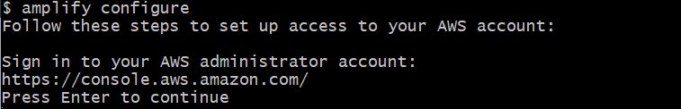

# AWS for Mobile

- [Front-End Web & Mobile on AWS](https://aws.amazon.com/products/frontend-web-mobile/)
- [AWS Amplify](https://aws.amazon.com/ko/getting-started/hands-on/build-ios-app-amplify/)
- [Amplify Framework Document for React](https://docs.amplify.aws/start/q/integration/react/)
- [React Document](https://reactjs.org/docs/getting-started.html)

`AWS` `Front-end` `Back-end` `Mobile`

## Front-End Web & Mobile on AWS

## Amplify Framework Document for React

The open-source Amplify Framework provides the following products to  build fullstack iOS, Android, Flutter, Web, and React Native apps:

- **Amplify [CLI](https://docs.amplify.aws/cli/)** - Configure all the services needed to power your backend through a simple command line interface.
- **Amplify [Libraries](https://docs.amplify.aws/lib/q/platform/ios/)** - Use case-centric client libraries to integrate your app code with a backend using declarative interfaces.
- **Amplify [UI Components](https://docs.amplify.aws/ui/)** - UI libraries for React, React Native, Angular, Ionic, Vue and Flutter.

The **Amplify [Hosting](https://aws.amazon.com/amplify/hosting/)** is an AWS service that provides a git-based workflow for continuous  deployment & hosting of fullstack web apps. Cloud resources created  by the Amplify CLI are also visible in the Amplify Console.

### Tutorial

- Set up an iOS application configured with Amplify
- Create a data model and persist data to Amplify DataStore
- Connect your local data to synchronize to a cloud backend

##### Prerequisites

- [Node.js](https://nodejs.org/) v14.x or later
- [npm](https://www.npmjs.com/) v6.14.4 or later
- [git](https://git-scm.com/) v2.14.1 or later

##### Sign up for an AWS account

- [Create AWS Account](https://portal.aws.amazon.com/billing/signup?redirect_url=https%3A%2F%2Faws.amazon.com%2Fregistration-confirmation#/start)

##### Install and configure the Amplify CLI

- Option1: [Video guide](https://youtu.be/fWbM5DLh25U)

- Option2:

  - 1-1) [CLI] NPM

    

    

  - 1-2) [CLI] Mac and Linux

  - 1-3) [CLI] Windows 

  - 2-1) [CLI] Setup the Amplify CLI 

    

  - 2-2) [AWS] Sign in AWS  `Root user`

  - 2-3) [CLI] Specify the AWS Region ➡ `us-east-1`

  - 2-4) [CLI] Specify the username of the new IAM user ➡ `amplify_test_1`

  - 2-5) [AWS] Add user 

    

    

    

    

  - 2-6) [CLI] Enter the `accessKeyID` and the `secretAccessKey`

  - Done

     

    

##### Set up fullstack project

1. Create a new React App 
2. Initialize a new backend 
3. [TBC](https://docs.amplify.aws/start/getting-started/setup/q/integration/react/)

