# AWS for Web & Mobile

- [Front-End Web & Mobile on AWS](https://aws.amazon.com/products/frontend-web-mobile/)
- [AWS Amplify](https://aws.amazon.com/ko/getting-started/hands-on/build-ios-app-amplify/)
- [Amplify Framework Document for React Native](https://docs.amplify.aws/start/q/integration/react-native/)

`AWS` `Front-end` `Back-end` `Web&Mobile`


## Front-End Web & Mobile on AWS

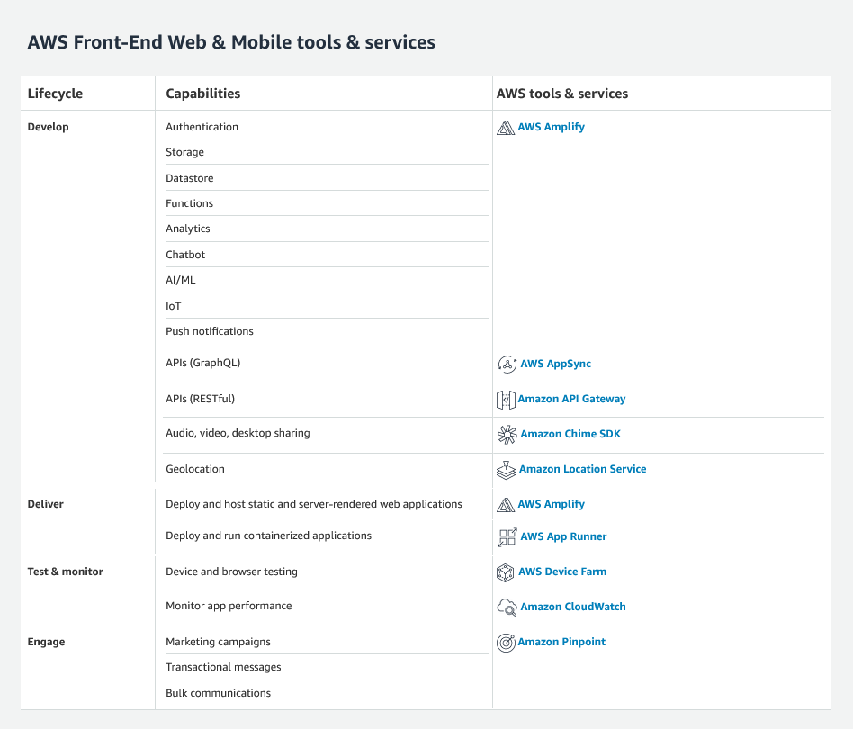


## Amplify Framework Document

The open-source Amplify Framework provides the following products to  build fullstack iOS, Android, Flutter, Web, and React Native apps:

- **Amplify [CLI](https://docs.amplify.aws/cli/)** - Configure all the services needed to power your backend through a simple command line interface.
- **Amplify [Libraries](https://docs.amplify.aws/lib/q/platform/ios/)** - Use case-centric client libraries to integrate your app code with a backend using declarative interfaces.
- **Amplify [UI Components](https://docs.amplify.aws/ui/)** - UI libraries for React, React Native, Angular, Ionic, Vue and Flutter.

The **Amplify [Hosting](https://aws.amazon.com/amplify/hosting/)** is an AWS service that provides a git-based workflow for continuous  deployment & hosting of fullstack web apps. Cloud resources created  by the Amplify CLI are also visible in the Amplify Console.


### Tutorial

- Set up an iOS application configured with Amplify
- Create a data model and persist data to Amplify DataStore
- Connect your local data to synchronize to a cloud backend


##### Prerequisites

- [Node.js](https://nodejs.org/) v14.x or later
- [npm](https://www.npmjs.com/) v6.14.4 or later
- [git](https://git-scm.com/) v2.14.1 or later

- Initialize a new [React Native application](https://facebook.github.io/react-native/docs/getting-started). There are two ways to do this:
  1. Expo CLI - Easier for new React Native developers
  2. React Native CLI - If you are already familiar with mobile development, enables you to build native code into your project.


##### Sign up for an AWS account

- [Create AWS Account](https://portal.aws.amazon.com/billing/signup?redirect_url=https%3A%2F%2Faws.amazon.com%2Fregistration-confirmation#/start)


##### Install and configure the Amplify CLI

- Option1: [Video guide](https://youtu.be/fWbM5DLh25U)

- Option2:

  - 1-1) [CLI] NPM

    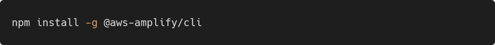

    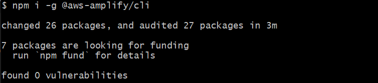

  - 1-2) [CLI] Mac and Linux 
    

  - 1-3) [CLI] Windows 
    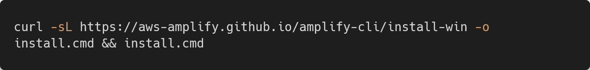

  - [CLI] Setup for Amplify CLI
    

    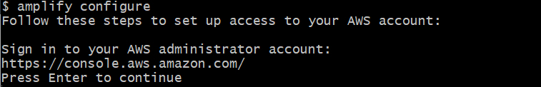

  - [AWS] AWS  `Root user` 로그인

  - [CLI] AWS Region 선택 ➡ `ap-northeast-1`

  - [CLI] 새로운 IAM user 이름 입력 ➡ `amplify_test_1`

  - 2-5) [AWS] 사용자 추가

    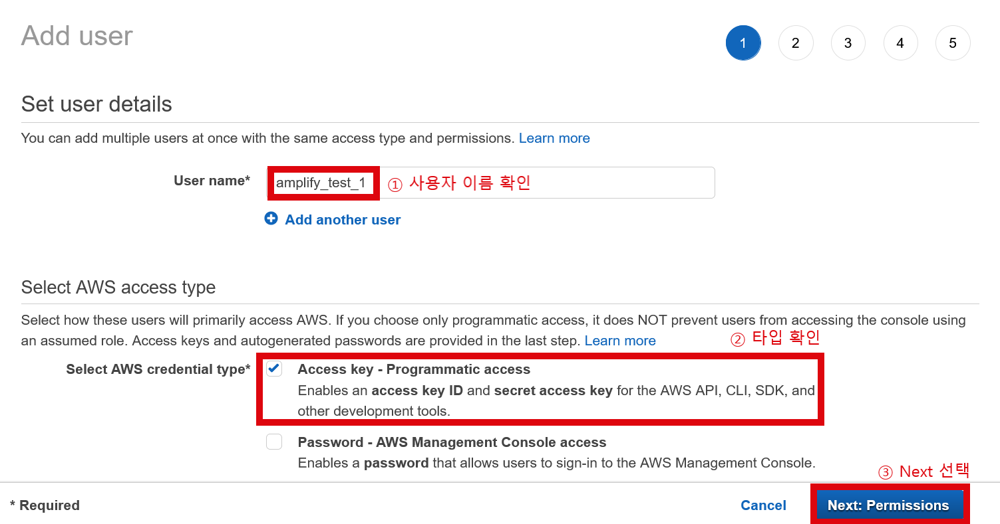

    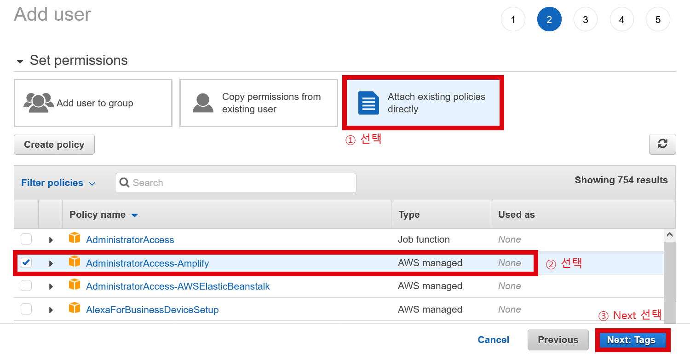

    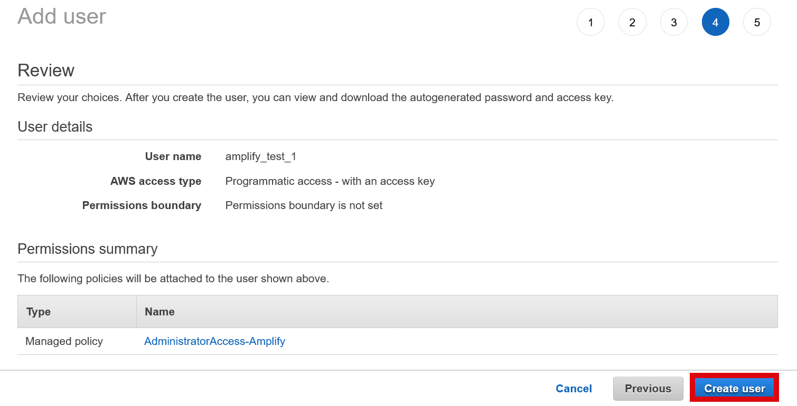

    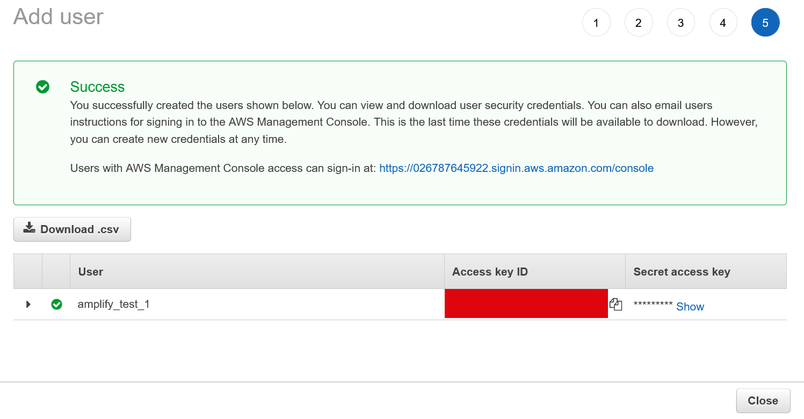

  - 2-6) [CLI] `accessKeyID` , `secretAccessKey` 차례대로 입력

  - 완료

     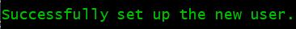

    

##### Set up fullstack project

1. Create a new React Native app 

   - Expo 
     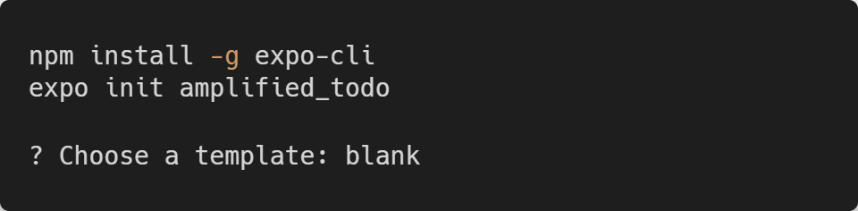

     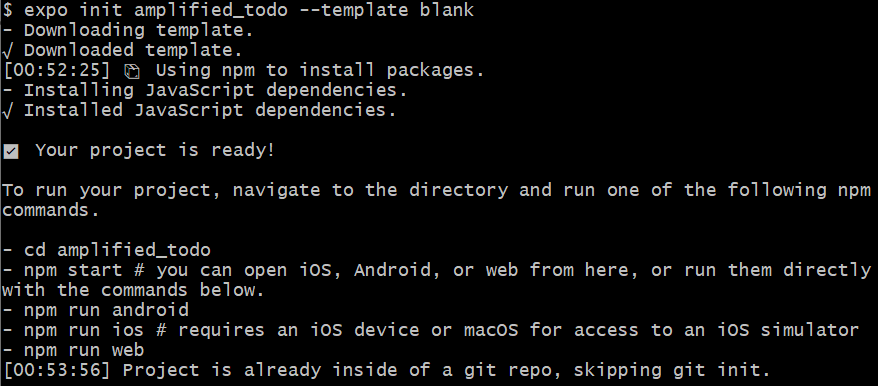

   - React Native CLI 
     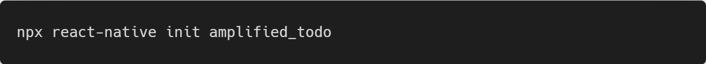


2. Install Amplify libraries

   - Expo 
     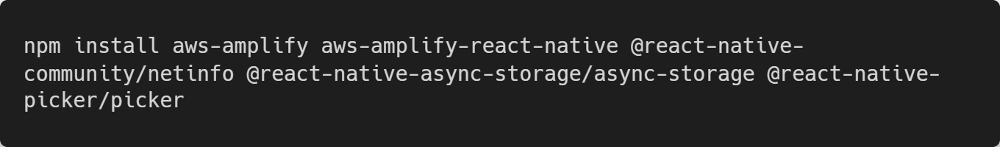

   - React Native CLI 
     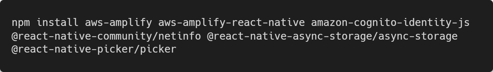

     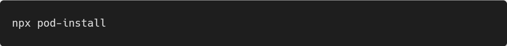

   - __App.js__ (Expo) or __index.js__ (React Native CLI)에 아래의 코드 추가
   
     ```javascript
     import { Amplify } from 'aws-amplify'
     import awsconfig from './src/aws-exports'
     Amplify.configure(awsconfig)
     ```


##### Generate model files

1. Create data model

   - [Amplify Studio](https://sandbox.amplifyapp.com/getting-started)

   -  `To-do list` ,  `React Native` 선택 ➡ `Get started` 선택 
     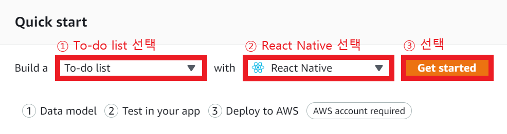

   - `isComplete(Boolean)` 추가
     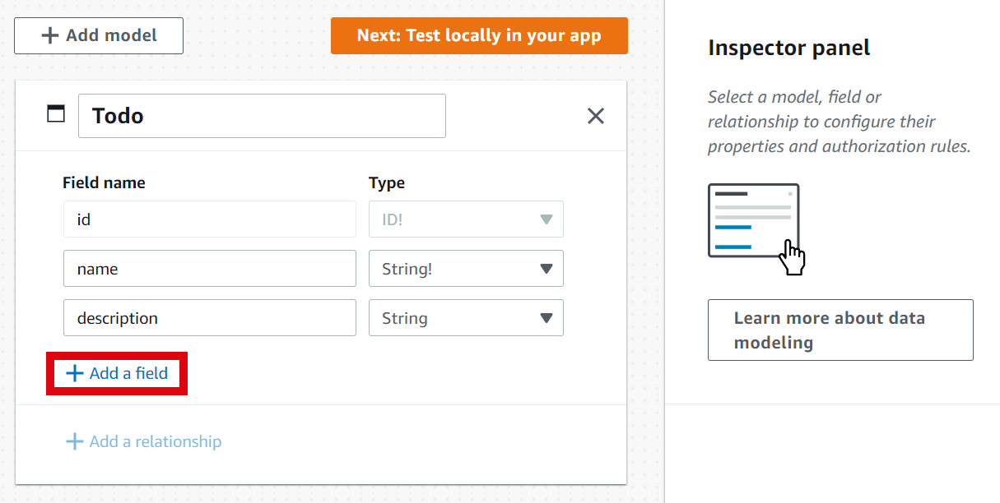 

     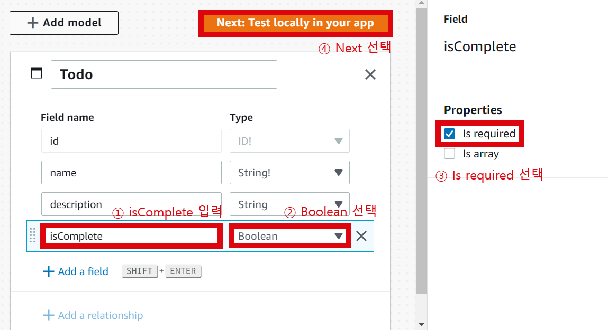


2. Generate the models locally
   - Install Amplify CLI to pull the data model
     - Amplify CLI 이미 설치 완료 `Skip`

     - 폴더로 이동 ➡ [CLI] 아래의 명령어 실행
        
       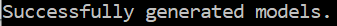
     - 혹시 모를 상황에 대비하여 `sandboxId` 기록해두기
     - 다음 단계들도 `Skip`
     - `Deploy` 선택
     - `amplify/backend/api/amplifyDatasource/schema.graphql` 확인 
       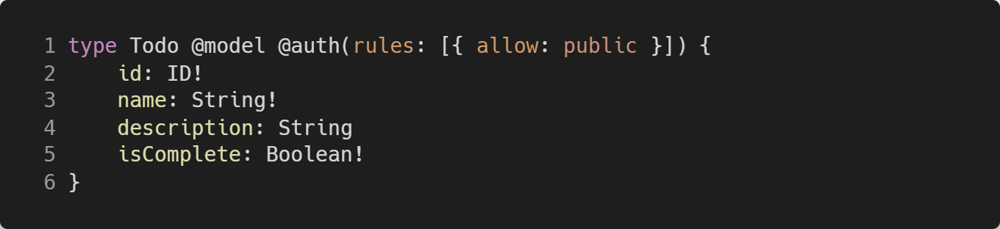

       - **id** - an auto-generated identifier field for a Todo item
       - **name** - a non-optional string field containing the name of a Todo item
       - **description** - an optional string field containing additional details about a Todo item
       - **isComplete** - a non-optional boolean field indicating the completion status of a Todo item
     
     

##### Integrate in your app

- **App.js** 파일 하단의 코드로 수정

  - **App.js** (Expo) 

    ```javascript
    import React from 'react';
    import { StatusBar, StyleSheet, View } from 'react-native';
    import { Amplify } from 'aws-amplify';
    import awsconfig from './src/aws-exports';
    import Home from './src/Home';
    
    Amplify.configure(awsconfig);
    
    export default function App() {
      return (
        <View style={styles.container}>
          <StatusBar />
          <Home />
        </View>
      );
    }
    
    const styles = StyleSheet.create({
      container: {
        backgroundColor: '#fff',
        flex: 1,
      },
    });
    ```

  - **index.js** (React Native CLI) 

    ```javascript
    import React from 'react';
    import { StatusBar, StyleSheet, View } from 'react-native';
    import Home from './src/Home';
    
    export default function App() {
      return (
        <View style={styles.container}>
          <StatusBar />
          <Home />
        </View>
      );
    }
    
    const styles = StyleSheet.create({
      container: {
        backgroundColor: '#fff',
        flex: 1,
      },
    });
    ```

- Create a Home component for our app which will implement most of the CRUD functionality for our app

  - `src/Home.js`에 __Home.js__ 파일 생성

  - **Header**: Simple Header component with Title.

  - **AddModal**: Used for displaying a Modal when a new Todo needs to be added.

  - **TodoList**: Used for displaying the list of Todos.

  - **Home**: Default component that wraps all the above component and a Button for adding a new Todo item.

  - 아래 코드 붙여넣기

    ```javascript
    import React, { useState, useEffect } from 'react';
    import {
      FlatList,
      Modal,
      Pressable,
      StyleSheet,
      Text,
      TextInput,
      View,
      Platform,
    } from 'react-native';
    import { DataStore } from 'aws-amplify';
    import { Todo } from './models';
    
    const Header = () => (
      <View style={styles.headerContainer}>
        <Text style={styles.headerTitle}>My Todo List</Text>
      </View>
    );
    
    const AddTodoModal = ({ modalVisible, setModalVisible }) => {
      const [name, setName] = useState('');
      const [description, setDescription] = useState('');
    
      async function addTodo() {
        //to be filled in a later step
      }
    
      function closeModal() {
        setModalVisible(false);
      }
    
      return (
        <Modal
          animationType="fade"
          onRequestClose={closeModal}
          transparent
          visible={modalVisible}
        >
          <View style={styles.modalContainer}>
            <View style={styles.modalInnerContainer}>
              <Pressable onPress={closeModal} style={styles.modalDismissButton}>
                <Text style={styles.modalDismissText}>X</Text>
              </Pressable>
              <TextInput
                onChangeText={setName}
                placeholder="Name"
                style={styles.modalInput}
              />
              <TextInput
                onChangeText={setDescription}
                placeholder="Description"
                style={styles.modalInput}
              />
              <Pressable onPress={addTodo} style={styles.buttonContainer}>
                <Text style={styles.buttonText}>Save Todo</Text>
              </Pressable>
            </View>
          </View>
        </Modal>
      );
    };
    
    const TodoList = () => {
      const [todos, setTodos] = useState([]);
    
      useEffect(() => {
        //to be filled in a later step
      }, []);
    
      async function deleteTodo(todo) {
        //to be filled in a later step
      }
    
      async function setComplete(updateValue, todo) {
        //to be filled in a later step
      }
    
      const renderItem = ({ item }) => (
        <Pressable
          onLongPress={() => {
            deleteTodo(item);
          }}
          onPress={() => {
            setComplete(!item.isComplete, item);
          }}
          style={styles.todoContainer}
        >
          <Text>
            <Text style={styles.todoHeading}>{item.name}</Text>
            {`\n${item.description}`}
          </Text>
          <Text
            style={[styles.checkbox, item.isComplete && styles.completedCheckbox]}
          >
            {item.isComplete ? '✓' : ''}
          </Text>
        </Pressable>
      );
    
      return (
        <FlatList
          data={todos}
          keyExtractor={({ id }) => id}
          renderItem={renderItem}
        />
      );
    };
    
    const Home = () => {
      const [modalVisible, setModalVisible] = useState(false);
    
      return (
        <>
          <Header />
          <TodoList />
          <Pressable
            onPress={() => {
              setModalVisible(true);
            }}
            style={[styles.buttonContainer, styles.floatingButton]}
          >
            <Text style={styles.buttonText}>+ Add Todo</Text>
          </Pressable>
          <AddTodoModal
            modalVisible={modalVisible}
            setModalVisible={setModalVisible}
          />
        </>
      );
    };
    
    const styles = StyleSheet.create({
      headerContainer: {
        backgroundColor: '#4696ec',
        paddingTop: Platform.OS === 'ios' ? 44 : 0,
      },
      headerTitle: {
        color: '#fff',
        fontSize: 20,
        fontWeight: '600',
        paddingVertical: 16,
        textAlign: 'center',
      },
      todoContainer: {
        alignItems: 'center',
        backgroundColor: '#fff',
        borderRadius: 2,
        elevation: 4,
        flexDirection: 'row',
        marginHorizontal: 8,
        marginVertical: 4,
        padding: 8,
        shadowOffset: {
          height: 1,
          width: 1,
        },
        shadowOpacity: 0.3,
        shadowRadius: 2,
      },
      todoHeading: {
        fontSize: 20,
        fontWeight: '600',
      },
      checkbox: {
        borderRadius: 2,
        borderWidth: 2,
        fontWeight: '700',
        height: 20,
        marginLeft: 'auto',
        textAlign: 'center',
        width: 20,
      },
      completedCheckbox: {
        backgroundColor: '#000',
        color: '#fff',
      },
      buttonText: {
        color: '#fff',
        fontWeight: '600',
        padding: 16,
      },
      buttonContainer: {
        alignSelf: 'center',
        backgroundColor: '#4696ec',
        borderRadius: 99,
        paddingHorizontal: 8,
      },
      floatingButton: {
        position: 'absolute',
        bottom: 44,
        elevation: 6,
        shadowOffset: {
          height: 4,
          width: 1,
        },
        shadowOpacity: 0.3,
        shadowRadius: 4,
      },
      modalContainer: {
        backgroundColor: 'rgba(0,0,0,0.5)',
        flex: 1,
        justifyContent: 'center',
        padding: 16,
      },
      modalInnerContainer: {
        backgroundColor: '#fff',
        borderRadius: 16,
        justifyContent: 'center',
        padding: 16,
      },
      modalInput: {
        borderBottomWidth: 1,
        marginBottom: 16,
        padding: 8,
      },
      modalDismissButton: {
        marginLeft: 'auto',
      },
      modalDismissText: {
        fontSize: 20,
        fontWeight: '700',
      },
    });
    
    export default Home;
    ```


  - [CLI] Expo 
    

    

    아직은 `Save Todo` 작동❌  
    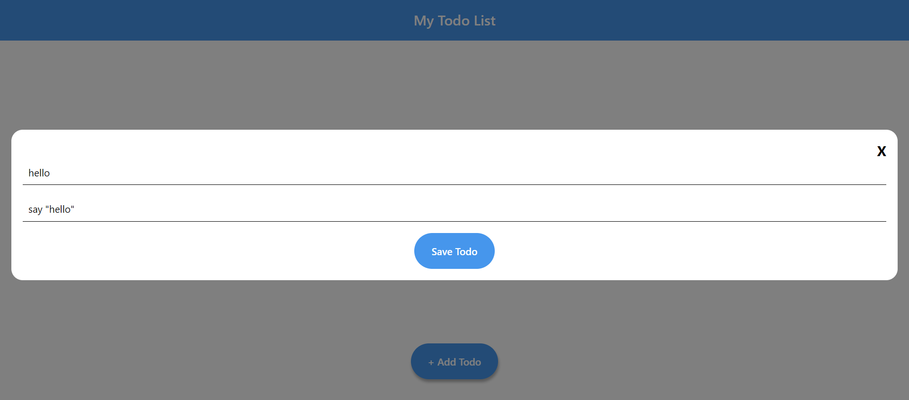

  - [CLI] React Native CLI on iOS 
    

  - [CLI] React Native CLI on Android 
    


  

##### Manipulating data 

- __Home.js__

1. Creating a Todo: __AddTodoModal__ 내부에 `addTodo()` 업데이트

   ```javascript
   async function addTodo() {
       await DataStore.save(new Todo({ name, description, isComplete: false }));
       setModalVisible(false);
       setName('');
       setDescription('');
     }
   ```

2. Querying for Todos and Observing Updates in Real-Time: __TodoList__ 내부에 `useEffect()` 업데이트

   ```javascript
   useEffect(() => {
   
       //query the initial todolist and subscribe to data updates
       const subscription = DataStore.observeQuery(Todo).subscribe((snapshot) => {
         //isSynced can be used to show a loading spinner when the list is being loaded. 
         const { items, isSynced } = snapshot;
         setTodos(items);
       });
   
       //unsubscribe to data updates when component is destroyed so that we don’t introduce a memory leak.
       return function cleanup() {
         subscription.unsubscribe();
       }
   
     }, []);
   ```

3. Updating a Todo: __TodoList__ 내부에 `setComplete()` 업데이트

   ```javascript
   async function setComplete(updateValue, todo) {
       //update the todo item with updateValue
       await DataStore.save(
         Todo.copyOf(todo, updated => {
           updated.isComplete = updateValue
         })
       );
     }
   ```

4. Deleting a Todo: __TodoList__ 내부에 `deleteComplete()` 업데이트

   ```javascript
   async function deleteTodo(todo) {
       try {
         await DataStore.delete(todo);
       } catch (e) {
         console.log('Delete failed: $e');
       }
     }
   ```

- 결과 
  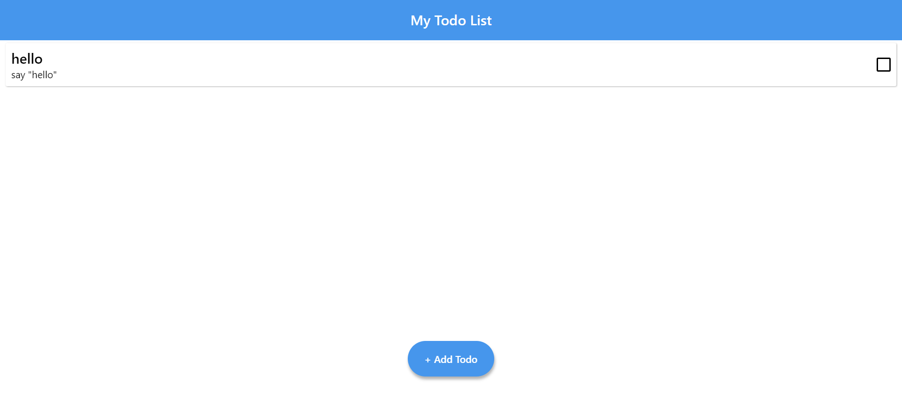 
  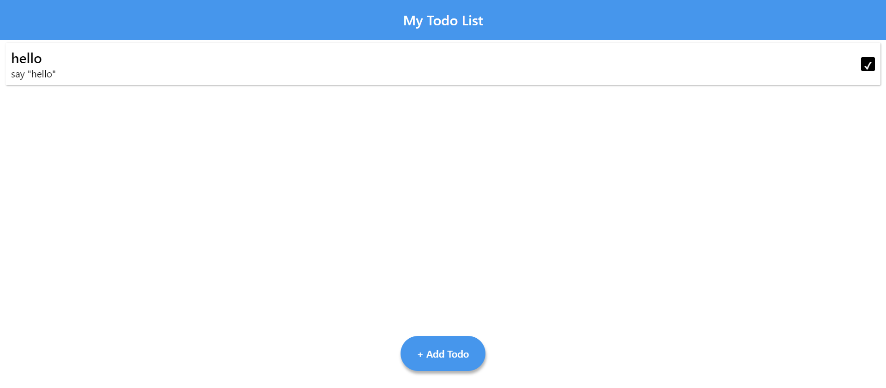


##### Connect to the cloud

1. Deploy your Amplify sandbox backend

   - `[단계] Generate model files - 2. Generate the models locally` 이어서

   - AWS 로그인

   - `Deploy` 선택

   - [AWS] App name ➡ `test`

   - [AWS] Deployment region ➡ `ap-northeast-1`

   - `Confirm deployment` 선택


     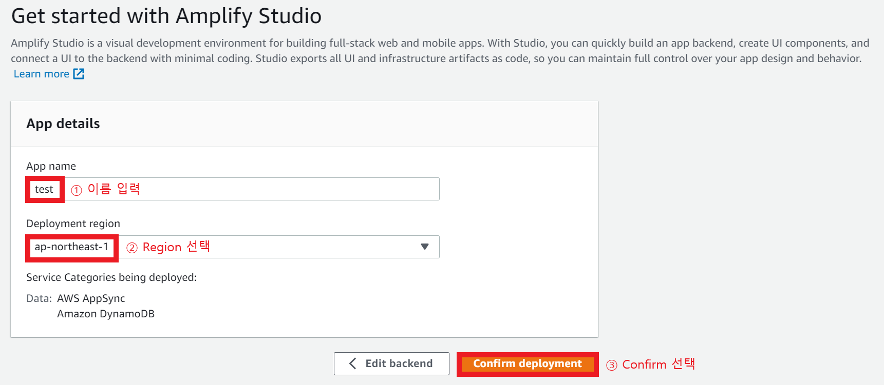

   - `Lauch Studio` 선택 
     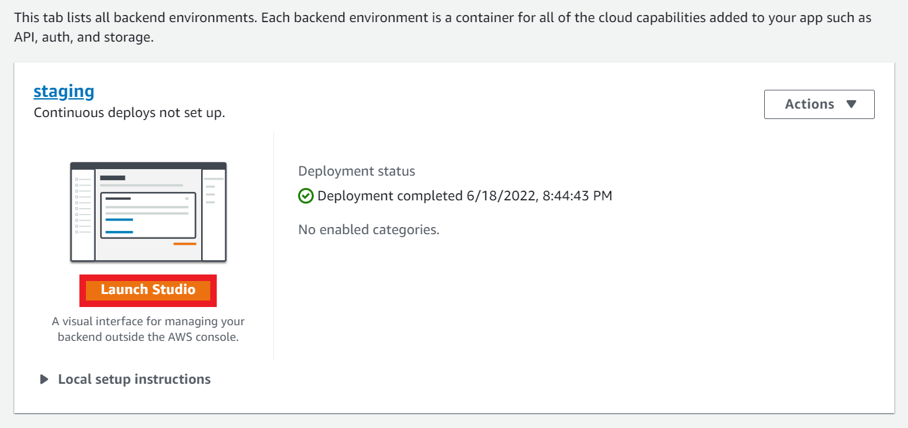


2. Add authentication

   - 사이드바에서 `Authentication` 선택
   - 기본 설정 유지 ➡ 하단에 `Save and deploy` 선택
   - 배포 후, 상단에 `Deployment successful` 선택 
     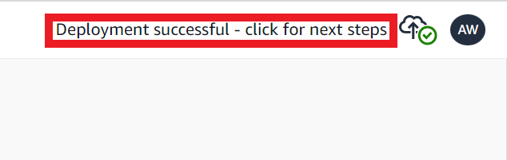
   - 안내에 따라 최신 버전으로 `pull` 
     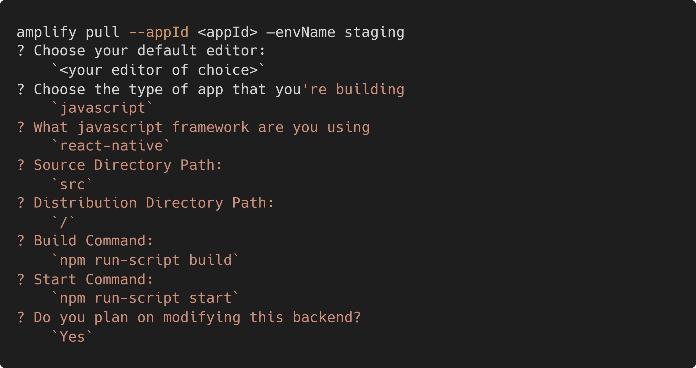
   

3. Verifying cloud sync

   - 사이드바에서 `Content` 선택

   - Todo를 추가할 경우 `Content`에서 확인 가능 
     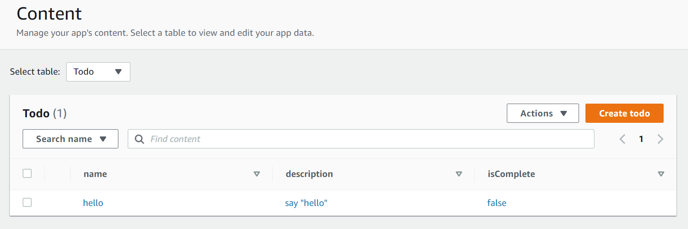

   - 데이터 추가 
     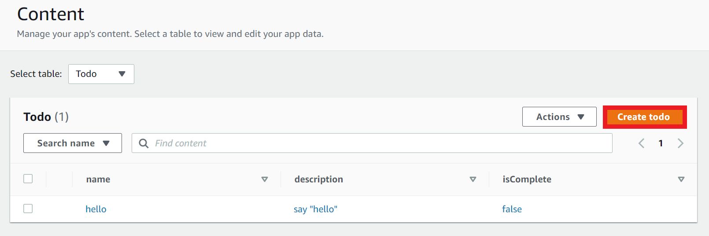

     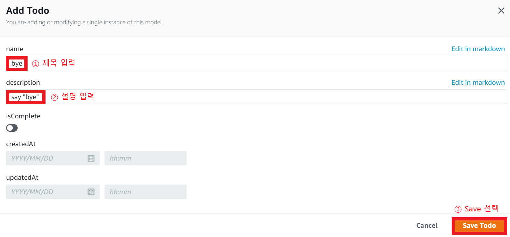

   - 결과 

     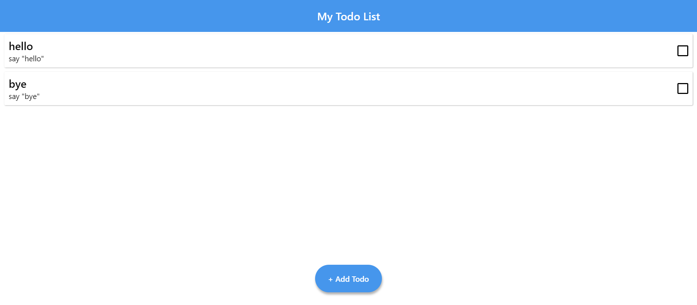


