# Linux 기초

> 2022/05/27 ~ ing

## 0. 준비

- [생활코딩-블로그](https://opentutorials.org/module/2538/14160)
- [생활코딩-강의](https://youtu.be/DsG-JWrFJTc)
- `AWS Cloud9` 

## 1. 기초

| 명령어              | 역할                                                         |                         |
| ------------------- | ------------------------------------------------------------ | ----------------------- |
| `ls`                | 현재 작업 중인 디렉토리의 폴더/파일 목록 불러오기            | list segments           |
| `-a`                | 옵션; 숨김 파일까지 모두 확인 가능                           | all                     |
| `-l`                | 옵션; 파일 정보를 자세히 확인 가능                           | long                    |
| `-S`                | 옵션; 파일 크기별로 정렬 (내림차순)                          | sort                    |
| `pwd`               | 현재 작업 중인 디렉토리 표시                                 | print working directory |
| `mkdir <폴더 이름>` | 폴더 생성                                                    | make directory          |
| `touch <파일 이름>` | 파일 생성                                                    |                         |
| `cd <경로>`         | 경로 변경                                                    | change directory        |
| `clear`             | 터미널 화면 지우기 스크롤바를 올리면 이전 내용 확인 가능 |                         |
| `rm <파일 이름`     | 파일 삭제                                                    | remove                  |
| `rm -r <폴더 이름>` | 폴더 삭제                                                    | recursive               |
| `<명령어> --help`   | 명령어 사용 방법 확인 (1)                                    |                         |
| `man <명령어>`      | 명령어 사용 방법 확인 (2) 전용 페이지로 이동            | manual                  |
| `sudo <명령어>`     | root 권한을 빌려 명령 실행                                   | super user do           |

##### nano

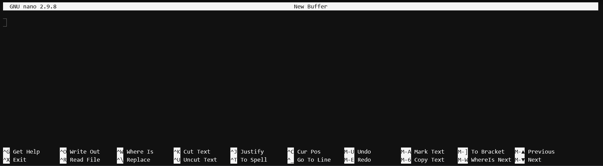

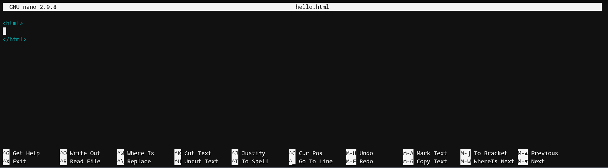

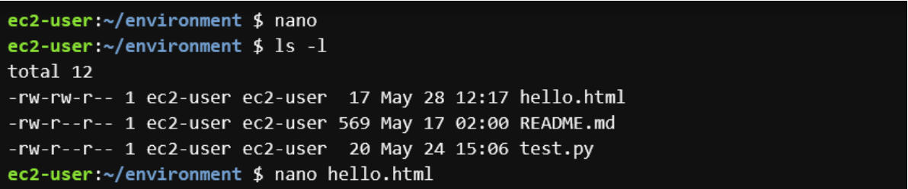

##### Package manager

- `apt`
  - `sudo apt-get update`: 최신 소프트웨어 목록 업데이트
  - `sudo apt-get upgrade`: 설치된 소프트웨어를 최신 버전으로 업그레이드
  - `sudo apt-cache search <프로그램 이름>`: 관련 프로그램 검색
  - `sudo apt-get install <프로그램 이름>`: 프로그램 설치
  - `sudo apt-get upgrade <프로그램 이름>`: 프로그램 업그레이드
  - `sudo apt-get remove <프로그램 이름>`: 프로그램 삭제
- `yum`: On Amazaon Linux use `yum` instead of `apt-get`
  - `sudo yum update`
  - `sudo yum upgrade`
  - `sudo yum search <프로그램 이름>`
  - `sudo yum install <프로그램 이름>`
  - `sudo yum upgrade <프로그램 이름>`
  - `sudo yum remove <프로그램 이름>`

##### wget & git

- `wget <옵션> <URL>`
  - `wget <URL>`
  - `wget -O <파일 이름> <URL>`
- git
  - `sudo yum install git`: git 설치
  - `git clone <URL> <DIR>`: 해당 디렉토리에 Git 저장소 복제

##### Sequence execution 

- semicolon `;`

  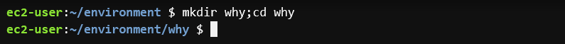

##### pipeline

- `grep`

  - `grep <옵션 > <검색어> <파일 이름>`

    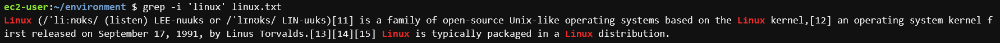

- pipeline `|`

  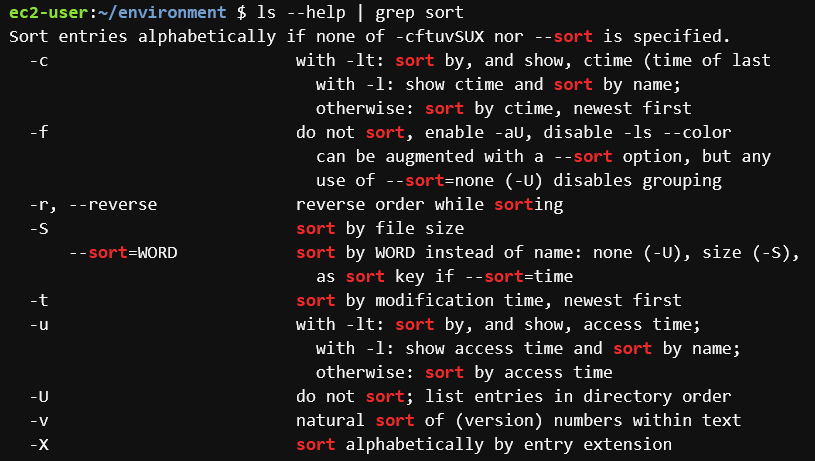

  

  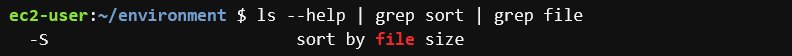

## 3. IO Redirection

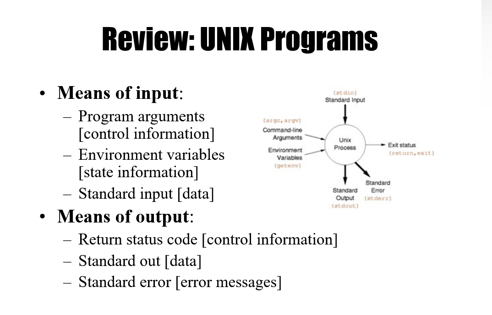

[Image Source](https://slideplayer.com/slide/5117573/)

- Standard Output `>` or `1>`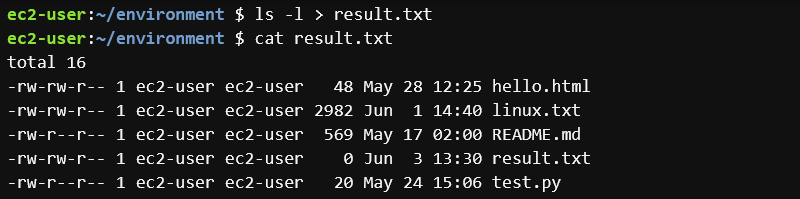
- Standard Error `2>`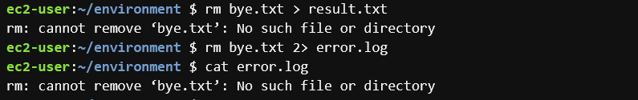
- 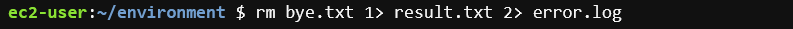
- `/dev/null`	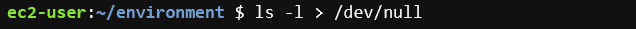

##### input

- `<`	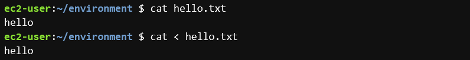

- `head <옵션> <파일이름>`

  - Command-line Arguments

    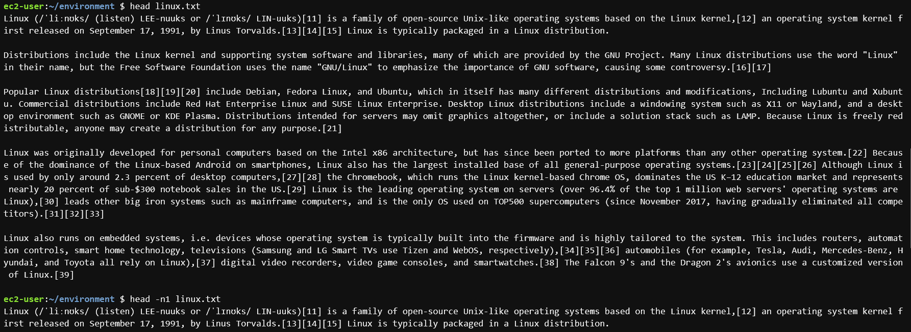

  - Standard Input 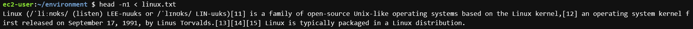

  - Redirection

    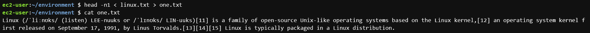

    - IO Stream

##### append

- `>>`

  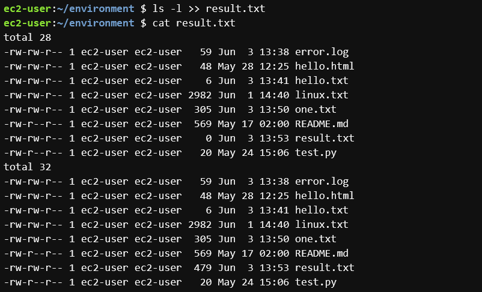

## 4. Shell

##### bash vs. zsh

- 편의성에 따라 선택

##### Shell script

- 자동화

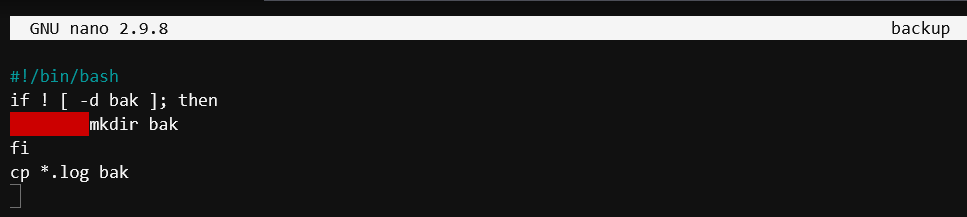

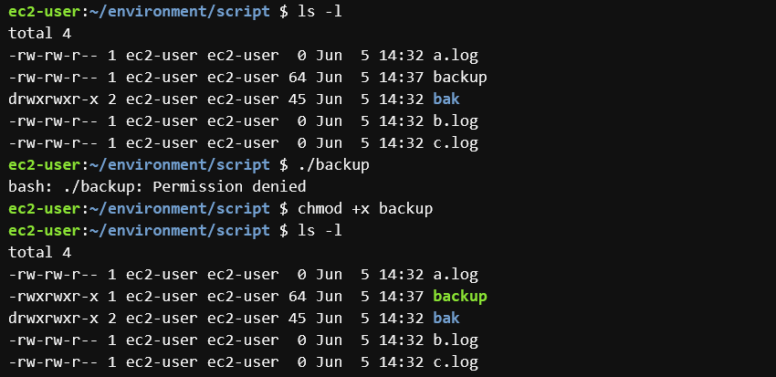

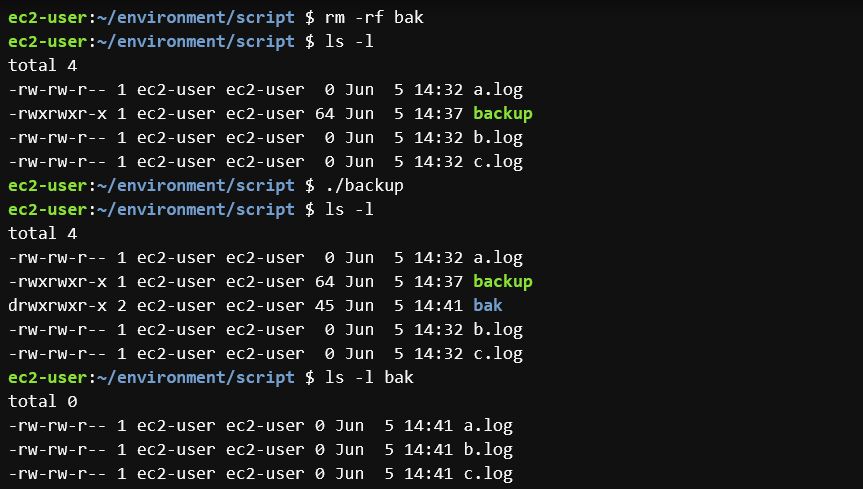

## Directory structure

## Process

`ps`

- 프로세스 조회
- `ps aux`
- PID: 프로세스 ID ➡ `sudo kill <PID>`
- `top`, `htop`: 프로세스 관찰/열람

## File find

`locate <파일 이름>`

- 데이터베이스: mlocate
  - `sudo updatedb`

`find`

- 디렉토리

  - `find /`: root 디렉토리

  - `find .`: 현재 디렉토리

  - `find ~`: 홈 디렉토리

- Permission denied ➡ `sudo find`
- `-type`: 데이터 타입으로 검색
- `-name`: 데이터 이름으로 검색

`whereis`

- `$PATH`: 환경변수

## Background Execute

- `jobs`: 백그라운드 작업 목록 출력
- `fg`: 백그라운드에서 실행되고 있는 작업 ➡ 포어그라운드로 
- `<명령어> &`: 명령어 백그라운드에서 실행

## Daemon

1. `sudo yum install apache2`
2. `cd /etc/init.d/`: daemon 프로그램들이 위치하는 곳으로 이동
3. `sudo service apache2 start`: apache2의 명령어 중 start 실행
4. `ps aux | grep apahce2`: 현재 실행되는 프로세스 중 apache2을 포함하고 있는 경우만 화면에 출력

5. `sudo service apache2 stop`: apache2 실행 종료

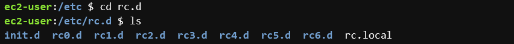

- `rc3.d/`: 콘솔 방식으로 리눅스 구동할 경우 
- `rc5.d/`: GUI 방식으로 리눅스 구동할 경우

## Cron

- 정기적으로 작업 실행

- `crontab -e`

  

  ​	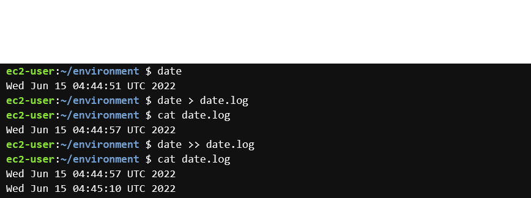

  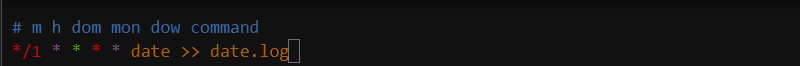

  

  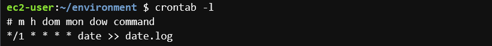

  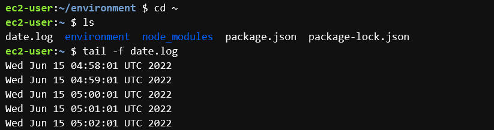

  
