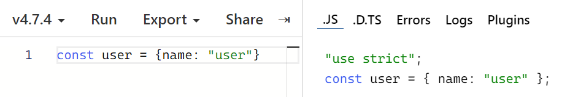
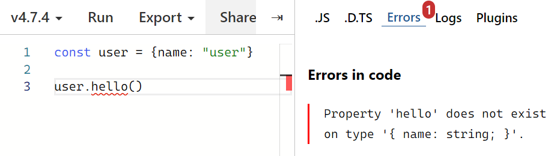
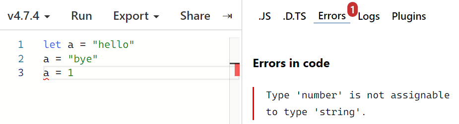
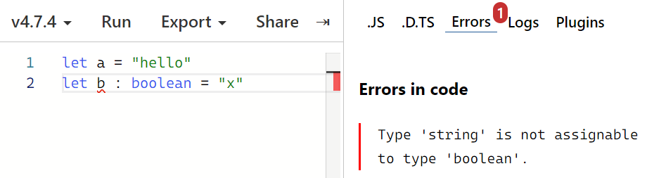
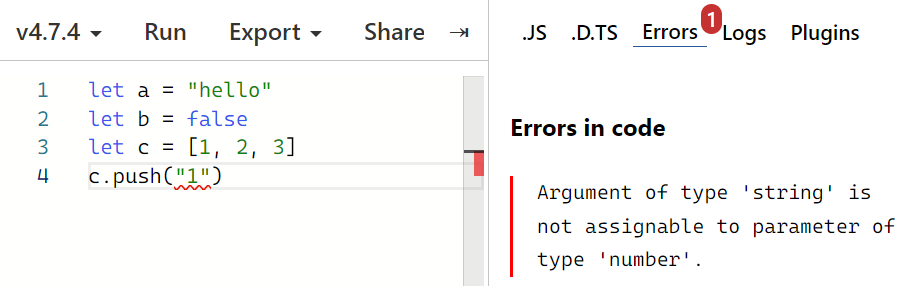

# TypeScript로 블록체인 만들기: Day 01

> 2022/06/27

- source: [TypeScript로 블록체인 만들기](https://nomadcoders.co/typescript-for-beginners)

`TypeScript` `Blockchain` `VSCode`


## Introduction

##### Why not JavaScript

- 유연함 ➡ 아무리 이상한 코드여도 실행 허용
  - 함수를 올바르게 사용하도록 강제하지 않음
  - 인자가 필수적인지 아닌지 인식하지 못함
  - 코드 실행 이전에는 오류를 판별하지 못함 

```javascript
[1, 2, 3, 4] + false  // '1,2,3,4false'
```

```javascript
function divide(a, b) {
    return a / b;
}

divide("xxxxxx");  // NaN; 오류가 발생하지 않음
```

```javascript
const user = {name: "user"};

user.hello();  // Uncaught TypeError
```


- **TypeScript** ➡ 타입 안전성
  - 코드 실행 이전에 오류를 판별할 수 있음


## Overview of TypeScript

##### How TypeScript Works

- **TypeScript**
  - A strongly typed programming language
  - 개발자가 실수하지 않도록 보호
  - 오류가 발생할 것 같은 코드 감지 ➡ 자바스크립트로 컴파일 ❌


[TypeScript 코드 테스트](https://www.typescriptlang.org/play)






##### Implicit Types vs. Explicit Types

```typescript
let a = "hello"
let b : boolean = false
let c = [1, 2, 3]  // let c : number[] = [1, 2, 3]
const player = {
    name: "user"
}
```








## Assignment 01

- Quiz: `7/7`