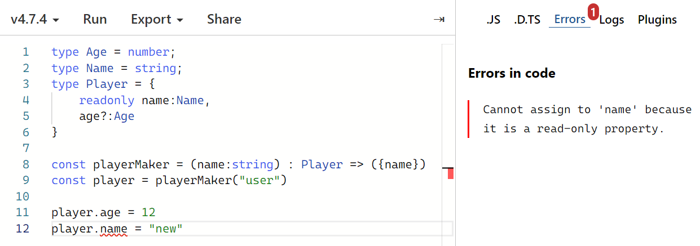
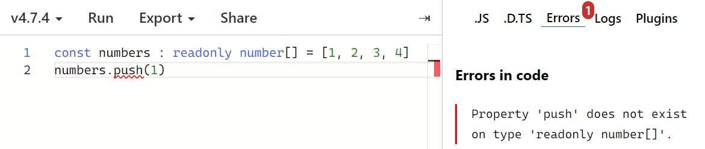
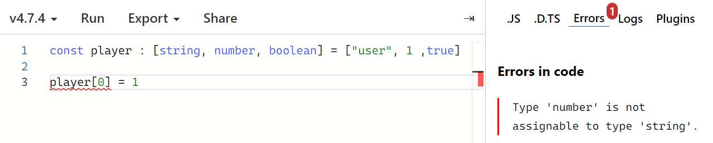
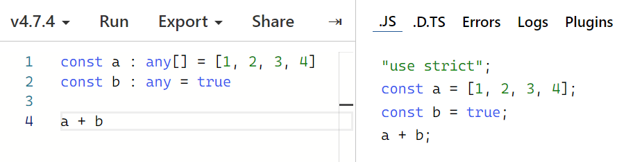
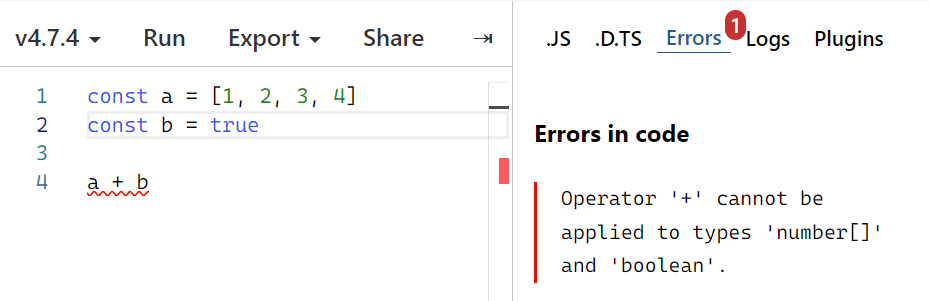

# TypeScript로 블록체인 만들기: Day 02

> 2022/06/28

- source: [TypeScript로 블록체인 만들기](https://nomadcoders.co/typescript-for-beginners)

`TypeScript` `Blockchain` `VSCode`


## Overview of TypeScript

##### Types of TypeScript

```typescript
const player : {
    name:string,
    age?:number  // age는 선택적 변수: number or undefined
} = {
    name:"user"
}
```

```typescript
const player01 : {
    name:string,
    age?:number
} = {
    name:"user01"
}

const player02 : {
    name:string,
    age?:number
} = {
    name:"user02",
    age:12
}
```

```typescript
type Player = {
    name:string,
    age?:number
}

const player01 : Player = {
    name:"user01"
}

const player02 : Player = {
    name:"user02",
    age:12
}
```

```typescript
type Age = number;
type Name = string;
type Player = {
    name:Name,
    age?:Age
}

function playerMaker(name:string) : Player {
    return {
        name
    }
}

const player = playerMaker("user")
player.age = 12
```

```typescript
type Age = number;
type Name = string;
type Player = {
    name:Name,
    age?:Age
}

const playerMaker = (name:string) : Player => ({name})
const player = playerMaker("user")
player.age = 12
```


- `readonly`: 읽기 전용
  - 값을 변경할 수 없음






- **Tuple**
  - 최소한의 길이를 가져야 함
  - 특정 위치에 특정 타입이 있어야 함
  - `readonly` 결합 가능

```typescript
const player : [string, number, boolean] = ["user", 1 ,true]
```




```typescript
let a : undefined = undefined
let b : null = null
let c = []  // any[]
```


- **any**: 타입스크립트의 보호장치에서 벗어나고 싶을 때 사용






- **unknown**
  - 변수의 타입을 알지 못할 때 사용
  - 타입 확인 작업 필요

```typescript
let a : unknown

if(typeof a === 'number'){
    let b = a + 1
}
if(typeof a === 'string'){
    let b = a.toUpperCase()
}
```


- **void**: 함수가 아무 것도 return 하지 않을 때

```typescript
function hell(){
    console.log('x')
}

// function hello(): void
```


- **never**: 함수가 절대 return 하지 않을 때 발생

```typescript
function hello() : never {
    throw new Error("xxx")
}
```

```typescript
function hello(name:string|number){
    if(typeof name === "string"){
        name
    }else if(typeof name === "number"){
        name
    }else{
        name  // name : never
    }
}
```


## Assignment 02

- Quiz: `11/11`