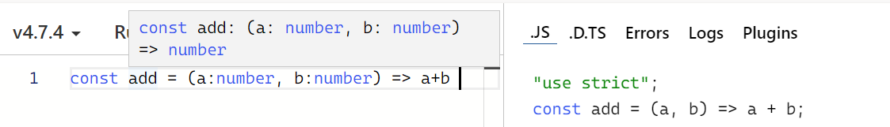
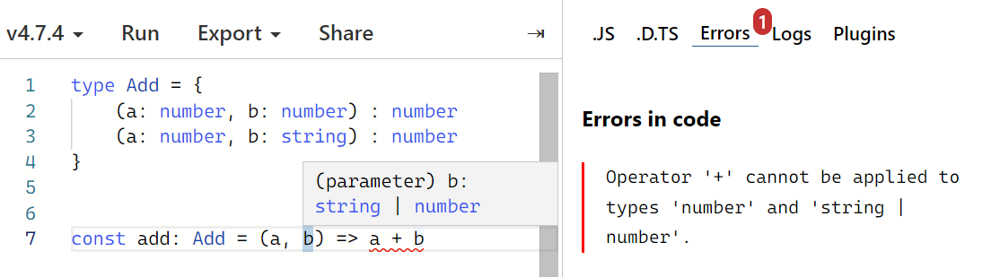
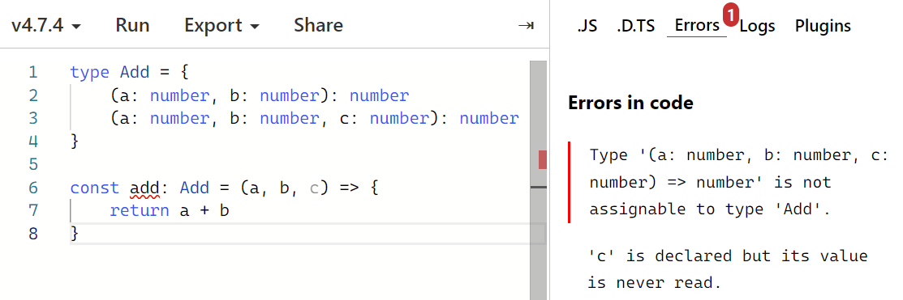

# TypeScript로 블록체인 만들기: Day 03

> 2022/06/29

- source: [TypeScript로 블록체인 만들기](https://nomadcoders.co/typescript-for-beginners)

`TypeScript` `Blockchain` `VSCode`


## Functions

##### Call Signatures

- 함수를 어떻게 호출해야 하는지,
- 함수의 반환 타입을 알려줌




```typescript
function add(a: number, b: number) {
    return a + b
}
```

```typescript
const add = (a: number, b: number) => a + b
```

```typescript
type Add = (a: number, b: number) => number;

const add: Add = (a, b) => a + b
```


##### Overloading

- 함수가 서로 다른 여러 개의 call signatures를 가지고 있을 때 발생



```typescript
type Add = {
    (a: number, b: number) : number
   	(a: number, b: string) : number
}

const add: Add = (a, b) => {
    if(typeof b === "string") return a
    return a + b
}
```

```typescript
type Config = {
    path: string,
    state: object
}

type Push = {
    (path: string): void
    (config: Config): void
}

const push: Push = (config) => {
    if(typeof config === "string") { console.log(config) }
    else {
        console.log(config.path, config.state)
    }
}
```




```typescript
type Add = {
    (a: number, b: number): number
    (a: number, b: number, c: number): number
}

const add: Add = (a, b, c?: number) => {
    if(c) return a + b + c
    return a + b
}
```


## Assignment 03

- Quiz: `5/6`

