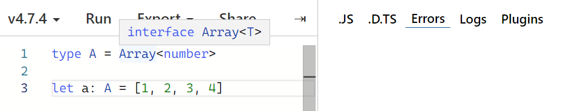

# TypeScript로 블록체인 만들기: Day 04

> 2022/06/30

- source: [TypeScript로 블록체인 만들기](https://nomadcoders.co/typescript-for-beginners)

`TypeScript` `Blockchain` `VSCode`


## Functions

##### Polymorphism

- **poly**: many, several, much, multi

- **morphos**: form, structure

- ➡ *many different structures*

  

```typescript
type SuperPrint = {
    (arr: number[]): void
    (arr: boolean[]): void
    (arr: string[]): void
    (arr: (number|boolean[])): void
}  // 모든 가능성을 조합해야 함

const superPrint: SuperPrint = (arr) => {
    arr.forEach(i => console.log(i))
}

superPrint([1, 2, 3, 4])
superPrint([true, false, true])
superPrint(["a", "b", "c"])
superPrint([1, 2, true, false])  
```


- **generic**

  - placehoder

  - 타입을 유추

  - 어떤 타입인지 확실하지 않을 때 사용

```typescript
type SuperPrint = {
    <TypePlaceholder>(arr: TypePlaceholder[]): void
}

const superPrint: SuperPrint = (arr) => {
    arr.forEach(i => console.log(i))
}

superPrint([1, 2, 3, 4]) 
superPrint([true, false, true])
superPrint(["a", "b", "c"])
superPrint([1, 2, true, false])  
```

```typescript
type SuperPrint = {
    <TypePlaceholder>(arr: TypePlaceholder[]): TypePlaceholder
}

const superPrint: SuperPrint = (arr) => arr[0]

const a = superPrint([1, 2, 3, 4]) 
const b = superPrint([true, false, true])
const c = superPrint(["a", "b", "c"])
const d = superPrint([1, 2, true, false]) 
```

```typescript
type SuperPrint = <T, M>(a: T[], b: M) => T

const superPring: SuperPrint = (a) => a[0]

const a = superPrint([1, 2, 3, 4], "x")
```


```typescript
function superPrint<V>(a: V[]){
    return a[0]
}

const a = superPrint([1, 2, 3, 4]) 
const b = superPrint([true, false, true])
const c = superPrint(["a", "b", "c"])
const d = superPrint([1, 2, true, false]) 
```

```typescript
type Player<E> = {
    name: string
    extraInfo: E
}

type UserExtra = {
    favFood: string
}

type UserPlayer = Player<UserExtra>

const user01: UserPlayer = {
    name: "user01",
    extraInfo: {
        favFood: "Kimchi"
    }
}

const user02: Player<null> = {
    name: "user02"
    extraInfo: null
}
```

```typescript
type A = Array<number>

let a: A = [1, 2, 3, 4]
```




## Assignmet 04

- Challenge: `submit`

