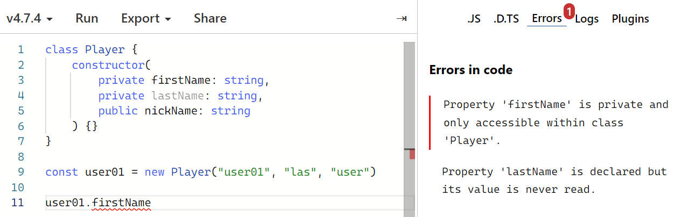
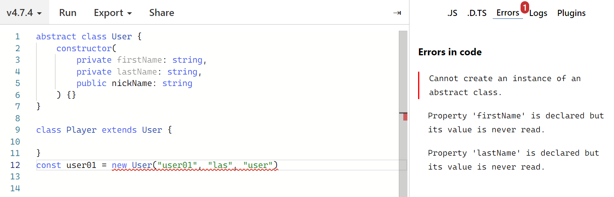

# TypeScript로 블록체인 만들기: Day 05

> 2022/07/01

- source: [TypeScript로 블록체인 만들기](https://nomadcoders.co/typescript-for-beginners)

`TypeScript` `Blockchain` `VSCode`


## Classes and Interfaces

##### Classes

- **public**
  - 기본적으로 적용
- **protected**
  - 다른 자식 클래스에서 접근 가능

- **private**

  - 해당 클래스 안에서만 접근이 가능

  - 인스턴스 밖, 다른 자식 클래스에서도 접근할 수 없음




- **abstract**
  - 추상 클래스
  - 다른 클래스가 상속받을 수 있는 클래스
  - 직접 새로운 인스턴스를 만들 수는 없음



```typescript
abstract class User {
    constructor(
    	private firstName: string,
        private lastName: string,
        public nickName: string
    ) {}
}

class Player extends User {

}
const user01 = new Player("user01", "las", "user")
user01.nickName
```

```typescript
abstract class User {
    constructor(
    	private firstName: string,
        private lastName: string,
        public nickName: string
    ) {}
	getFullName(){
        return ${this.firstName} ${this.lastName}
	}
}

class Player extends User {

}
const user01 = new Player("user01", "las", "user")
user01.getFullName()
```


- 추상 메소드
  - 구현이 되어 있지 않은 (코드가 없는) 메소드
  - call signature만 가짐
  - 함수 이름과 argument를 안 받을 때도 있음
  - 추상 클래스를 상속받는 클래스에서 추상 메소드 구현

```typescript
abstract class User {
    constructor(
    	private firstName: string,
        private lastName: string,
        private nickName: string
    ) {}
    abstract getNickName(): void  // 추상메소드; call signature
	getFullName(){
    	return ${this.firstName} ${this.lastName}
	}
}

class Player extends User {
    getNickName() {
        console.log(this.nickName)  // private; 접근 불가
    }

}
const user01 = new Player("user01", "las", "user")
user01.getFullName()
```

```typescript
abstract class User {
    constructor(
    	protected firstName: string,
        protected lastName: string,
        protected nickName: string
    ) {}
    abstract getNickName(): void  
	getFullName(){
    	return ${this.firstName} ${this.lastName}
	}
}

class Player extends User {
    getNickName() {
        console.log(this.nickName)  // protected; 접근 가능
    }

}
const user01 = new Player("user01", "las", "user")
user01.firstName  // protected; 접근 불가능
```


## Assignment 05

- Challenge: `submit`

