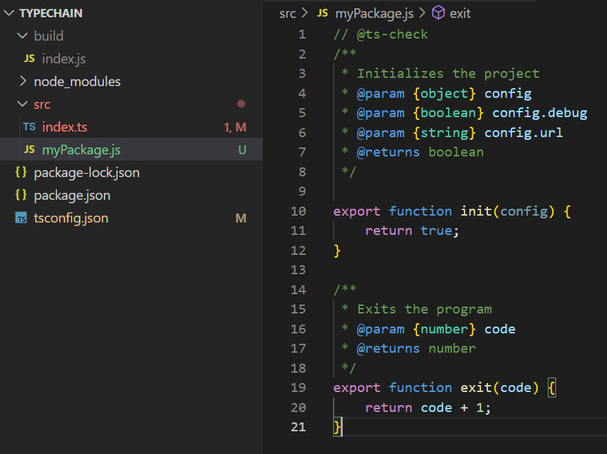
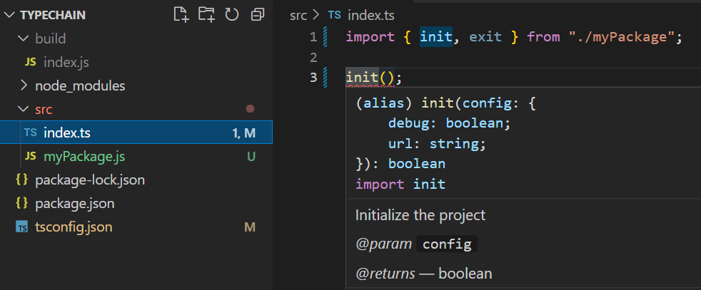

# TypeScript로 블록체인 만들기: Day 11

> 2022/07/07

- source: [TypeScript로 블록체인 만들기](https://nomadcoders.co/typescript-for-beginners)

`TypeScript` `Blockchain` `VSCode`


## TypeScript Blockchain

##### Targets

- `tsconfig.json`: VSCode ➡ 타입스크립트로 작업할 것을 인식 ➡ 자동완성기능 제공

  - `include`: 타입스크립트 파일이 어디에 위치하는지

  - `outDir`: 자바스크립트 파일이 생성될 디렉토리 지정

    

    

    

    

  - `target`: 타입스크립트를 어떤 버전의 자바스크립트로 컴파일할지

    - **ES3**: `const`&화살표 함수 존재하지 않음
    - **ES6**: 가장 이상적

    


##### Lib Configuration

- `lib`: 라이브러리의 **정의 파일**을 특정해주는 역할
  - 자바스크립트의 어떤 버전이 그 환경에서 사용되는지 (런타임 환경)
  - `DOM` (브라우저) ➡ 타입스크립트 파일에서 `document` 사용 가능


##### Declaration Files

- 타입 정의: 타입스크립트에게 자바스크립트 코드 타입을 설명해주기 위해 사용 ➡ `d.ts`

```typescript
interface Config {
    url: string
}
declare module "myPackage" {
    function init(config: Config): boolean;
    function exit(code: number): number;
}
```


##### JSDoc

- `@ts-check`: 타입스크립트 파일에게 자바스크립트 파일을 확인하라고 알림
- `JSDoc`: 코멘트






## Assignment 08

- Quiz: `8/8`
