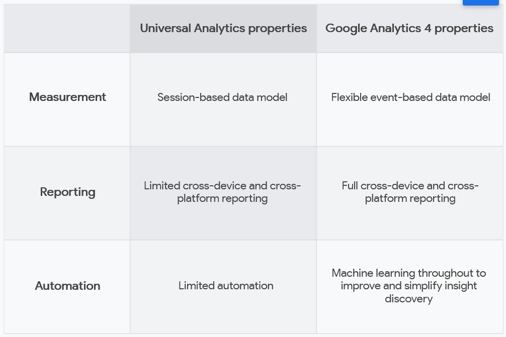
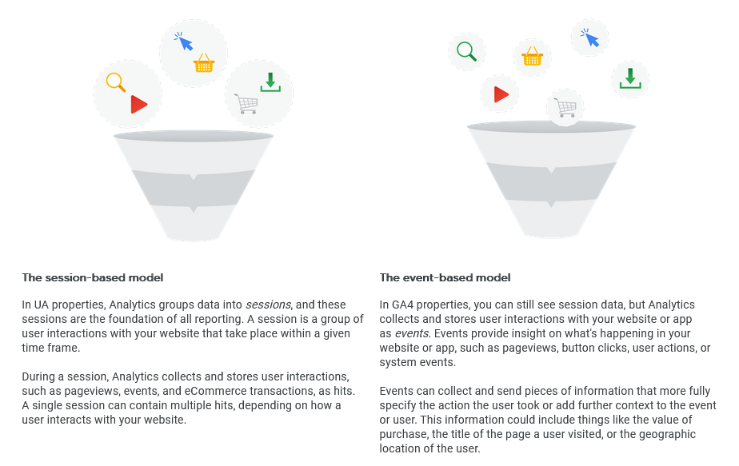
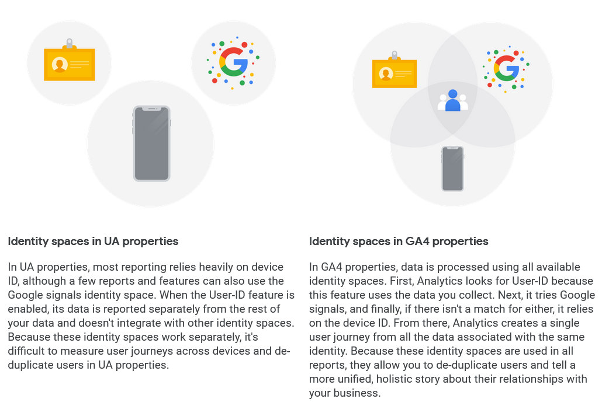
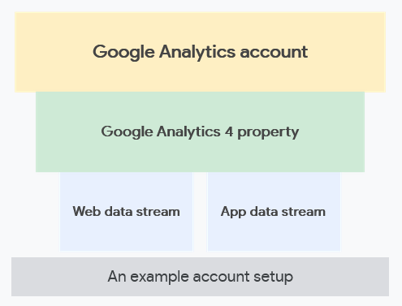

# Discover the Next Generation of Google Analytics

> 2022/06/15

- source: [Google Skillshop](https://skillshop.exceedlms.com/student/path/66729-discover-the-next-generation-of-google-analytics?enrollment_id=116501403)

## Discover What's New with Google Analytics

- Google Analytics 4 properties were briefly known as __"App + Web properties"__
- In the past, there were only two kinds of properties:
  - Universal Analytics for measuring mobile app activity
  - Google Analytics for Firebase for measuring mobile app activity

##### The benefits of Google Analytics 4 properties

- Scales with your business
- Adapts to a changing environment
- Reveals intelligent business insights
- Helps you achieve your marketing goals

##### Integrated reporting

- Full reporting across devices
  - Analytics can measure a single user journey across devices based on the best available user identifiers
- Unified web and app reporting
- Integrated reporting and analysis

## What Sets Google Analytics 4 Properties Apart

##### How Google Analytics 4 properties differ from Universal Analytics properties

##### Some more key differences

- Audiences
  - A set of users you define based on different attributes that are important to your business
- Advanced features available to all Analytics accounts
  - Explorations
  - BigQuery Export

##### How Google Analytics 4 properties collect and process data

- Rather than using a session-based model, which groups user interactions within a given time frame, it uses an __event-based model__, which processes each user interaction as a standalone event 

##### Identity spaces in Google Analytics

- User-ID
- Google signals
- Device ID

- When you only have access to one identity space, like device ID, a single person could appear as a different user every time they interact with your business on a different device
- But when you use multiple identity spaces, you can get better insight into user journeys, with more robust cross-device and cross-platform data and reporting that reflects de-duplicated users

- With GA4 properties, you can answer questions like:
  - How many total unique users do you have, no matter what platforms they use?
  - How many conversations have occurred on your app and website in the last week -- and which platform is contributing to most of these conversations?

## Get to Know Google Analytics 4 Properties

##### The next generation of Reports and Explorations

- Quickly and easily filter, segment, sort, and refactor your data to home in on the insights you care about
- Drag and drop the dimensions and metrics you're interested in

##### Get to know Reports in Google Analytics 4 properties

- Summary reports
- The Realtime report
  - See different segments of users side by side to compare how they're performing in real time
  - Easily create a new segment that you can also use in other reports

##### Get to know Explorations

- Free form exploration
- Funnel exploration
- Path exploration
- Segment overlap
- User exploration
- Cohort exploration

##### Find what you need with the search tool

- Search for instant answers
- Search for reports, admin pages, or insights
- Search for account or property configuration
- Search help content

## Create Your Own Google Analytics 4 Property

##### Understand the Analytics property structure

##### How to set up Google Analytics 4 property

1. Open your Google Analytics account
2. Create a GA4 property
3. Create a data stream
4. Enable data collection

